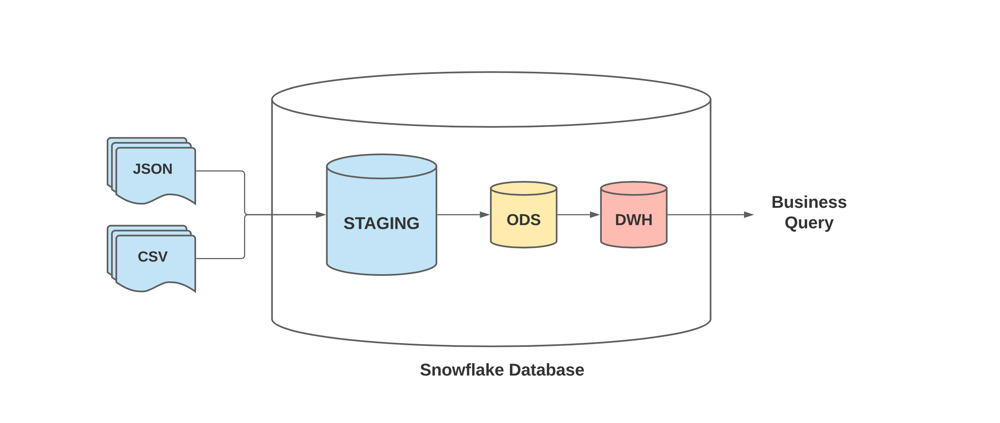
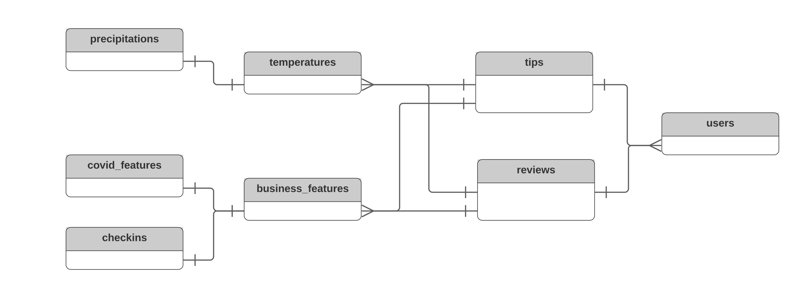
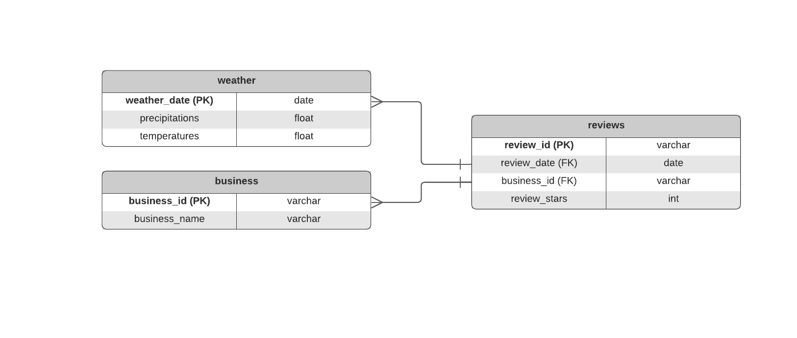

# snowflake-etl-template
Scripts to transfer and process data in snowflake.

# Design
The database consists in 3 stages:
- A Staging Area, where raw data are uploaded
- An Operational Data Store (ODS), where clean transactional data are stored
- A Data Warehouse (DWH), where data for analytics query are stored



In the ODS, data are modelled as a (simplified) snowflake schema - with 2 dimension tables (reviews and tips):


In the DWH, data are modelled as a star schema with reviews as transaction table:



## Configuration 

### Snowflake credentials
Add user credentials in `~/.snowsql/config`
Copy credentials in `config/snowflake.config` with format:
```
[SNOWFLAKE]
user=..
password=..
account=..
```

### Download Data
Download weather and yelp data and store them in the directory pointed by `src.constants.DIR_DATA`
```
# weather data - get weather from nevada
https://crt-climate-explorer.nemac.org
# yelp data
https://www.yelp.com/dataset/download
```

## Test
To run the tests, execute:
```
# create test set
python src/preparation/create_test_data.py

# run tests
python -m unittest discover tests
```

## Usage

### Partition big datasets
Users and Reviews are multi-Gb files.
It is suggested to split them and upload one chunk at a time.
To split them, run:
```
# split user dataset
python src/split_json_file.py \
--rel-path-file=yelp_dataset/yelp_academic_dataset_user.json \
--chunk-size=100000

# split review dataset
python src/split_json_file.py \
--rel-path-file=yelp_dataset/yelp_academic_dataset_review.json \
--chunk-size=250000
```

### Run the etl
In order to transfer and process the data into a snowflake database, run:
```
DIR_DATA=your_data_path

# create a new database
snowsql -f src/etl/db_reset.sql -D DB_NAME=snowflake_db

# upload data in the staging area
python src/etl/stage_upload_data.py \
--db-name=snowflake_db \
--dir-data=$DIR_DATA

# run the etl on real dataset 
python src/etl/db_execute_etls.py --db-name=snowflake_db 

# compare dimension of raw files vs uploaded files
python src/etl/stage_dim_comparison.py \
--db-name=snowflake_db \
--dir-data=$DIR_DATA
```
